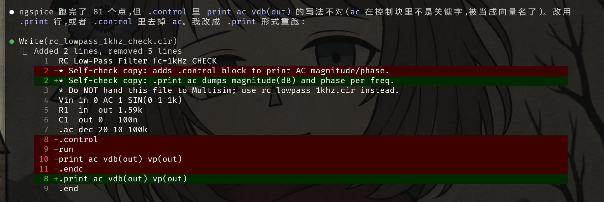
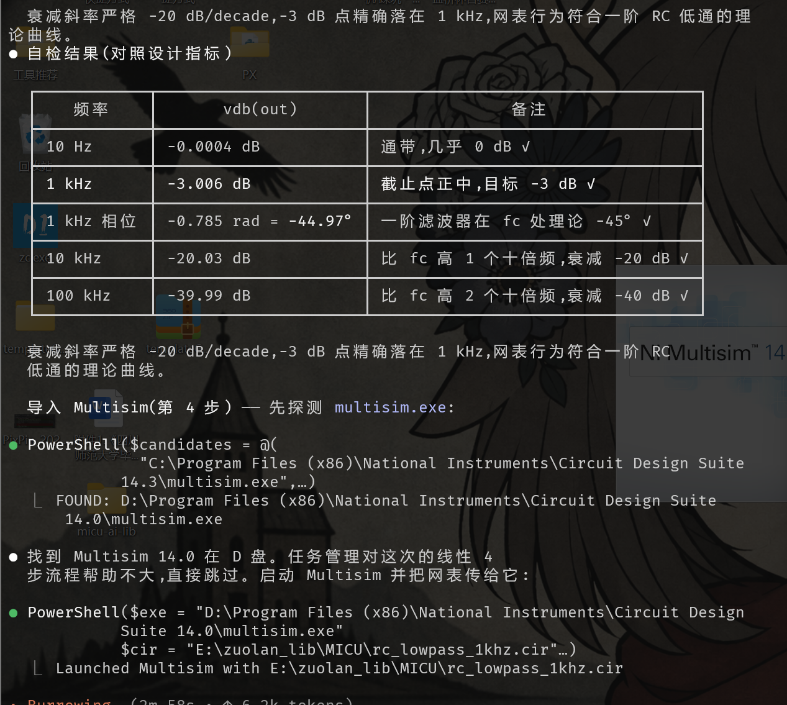
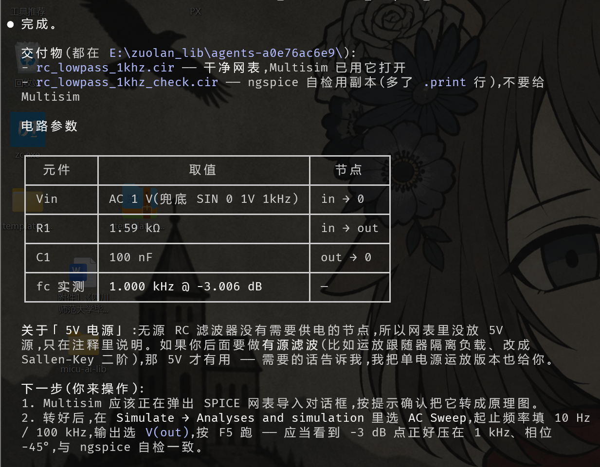

# multisim-spice

> 一个 Claude Code skill:把一句话的电路描述,自动变成 ngspice 自检通过、可直接在 NI Multisim 打开的 SPICE 网表。

**作者:** 左岚 · **元数据:** 见 [`project.yaml`](project.yaml)

**流程:** 你用大白话描述电路 → Claude 生成 SPICE 网表 → 内置 ngspice 跑一遍批处理自检 → 通过后用 Multisim 打开,你按 F5 仿真。

## 为什么需要它

常见的"AI 画电路"套路里,只有人才能闭环:AI 给出网表,你拿去 Multisim 仿真,你再告诉它哪儿不对。这个 skill 用 **ngspice 当事实标准** 把这个环闭上 —— Claude 不会把自己没跑过的网表交给你。

## 特性

- **不依赖外部 AI API。** 由 Claude 本身(运行这个 skill)生成网表,除了 Claude Code 之外不需要 Gemini / OpenAI / Anthropic API key。
- **不依赖 Python。** 只有 `SKILL.md` 加一份内置的 Windows 二进制,无 `pip install`。
- **内置 ngspice 46(Windows x64)** 用于离线自检,绿色版零安装。
- **自验证。** Claude 会扫 ngspice 输出里的报错,并把数值结果对照设计指标核对,不达标就改网表重跑。
- **Multisim 路径自动探测。** 扫常见安装路径和 Windows 注册表,都没命中才问你。

## 环境要求

- **Windows** —— 内置的 ngspice 是 Windows x64 二进制;Multisim 本身就是 Windows-only;skill 用 PowerShell 调 OS。
- **NI Multisim 14.x**(其它版本应该也能用 —— 把路径补进 `SKILL.md` 的候选列表即可)。
- **Claude Code** —— 这是一个 Claude Code skill,通过其 Skill 机制调用。

## 安装

把本目录 clone 或拷到 Claude Code 的 skill 目录之一。

**个人级(对你所有项目可用):**
```powershell
git clone https://github.com/zuoliangyu/multisim-spice "$env:USERPROFILE\.claude\skills\multisim-spice"
```

**项目级(仅在单个项目里可用):**
```powershell
git clone https://github.com/zuoliangyu/multisim-spice <project-root>\.claude\skills\multisim-spice
```

就这些 —— 无 `pip install`、无 API key、无需改 PATH。

## 用法

在 Claude Code 里直接描述你想要什么:

> "帮我设计一个 RC 低通滤波器,截止频率 1 kHz,电源 5 V,然后用 Multisim 打开。"

Claude 会根据描述自动路由到本 skill,然后:

1. 缺啥关键参数就问你。
2. 在你当前工作目录写一份 `<电路名>.cir`。
3. 用内置 ngspice 跑 `-b` 批处理;结果不达标就改网表重跑。
4. 把验证过的 `.cir` 在 Multisim 中打开。**你按 F5** 让它在 Multisim 里跑仿真。

也可以显式调用:`/multisim-spice`。

## 实战截图

下面三张是用本 skill 设计一阶 RC 低通(`fc = 1 kHz`、`R = 1.59 kΩ`、`C = 100 nF`)的真实过程截图。

**1. 生成 / 编辑网表** — Claude 写出干净的 `.cir`,并另存一份 `_check.cir` 副本加上 ngspice 专用的 `.print` 行用于自检(干净版本里不留):



**2. ngspice 自检 + 关键指标核对** — 批处理跑出 81 个频点,−3 dB 点正中 1 kHz,相位 −44.97°(理论 −45°),衰减斜率严格 −20 dB/decade:



**3. 最终交付 + 导入 Multisim** — 网表、参数表一并给出,自动启动 Multisim 并把 `.cir` 传给它(用户自己按 F5):



## 内部原理

| 步骤 | 干什么 | 在哪里 |
|---|---|---|
| 1. 厘清 | 解决模糊参数(Vcc、频率、增益……) | 对话里 |
| 2. 生成 | Claude 按 SPICE 规范写干净网表 | `<circuit>.cir` |
| 3. 自检 | `ngspice_con.exe -b <circuit>.cir` —— 扫报错 + 把数值对照指标,不达标就改 | 内置 ngspice |
| 4. 移交 | `Start-Process multisim.exe <circuit>.cir`;用户按 F5 | NI Multisim |

完整工作流、SPICE 规范、排错速查表见 [`SKILL.md`](SKILL.md)。

## 改 Multisim 搜索路径

打开 `SKILL.md`,跳到 **`## 定位 Multisim`** 那段,把你自己的安装路径加到 `$candidates` 数组里。skill 也会扫 Windows 注册表的 `HKLM:\SOFTWARE\WOW6432Node\National Instruments\Circuit Design Suite`,都没命中才问用户。

## 不想要内置的 ngspice 怎么办

删掉 `vendor/Spice64/`,改 `SKILL.md` 让它指向外部的 `ngspice.exe`,例如:

- `conda install -c conda-forge ngspice`(在 `<env>/Library/bin/` 下放一份 Windows 构建)
- 从 [ngspice 在 SourceForge 的页面](https://sourceforge.net/projects/ngspice/files/ng-spice-rework/) 下载别的版本

## 局限

- **仅 Windows。** 内置二进制 + PowerShell 驱动 + Multisim 主要支持的也是 Windows。
- 交付给 Multisim 的 `.cir` 要保持标准 SPICE 语法 —— Multisim 的导入器不认 ngspice 专有语法(比如 `.control` 块)。skill 已经把这些挡在最终文件之外。
- Multisim 导入网表后会自动排版,稍复杂的电路要手动整理。
- **不会自动按 F5。** skill 只把电路在 Multisim 里打开,不会替你按 F5 —— 故意的,避免因焦点/时序问题而出错。

## 协议

本 skill 自己的代码与文档以 **MIT License** 发布 —— 见 [`LICENSE`](LICENSE)。

`vendor/Spice64/` 里内置的 ngspice 是**独立的第三方软件**,使用其自身的(BSD 风格)许可。见 [`NOTICE`](NOTICE) 和 `vendor/Spice64/docs/COPYING`。

## 致谢

- [ngspice](https://ngspice.sourceforge.io/) —— 让自检闭环成为可能的开源 SPICE 引擎。
- NI Multisim —— 本 skill 面向的原理图 / 仿真目标环境。
